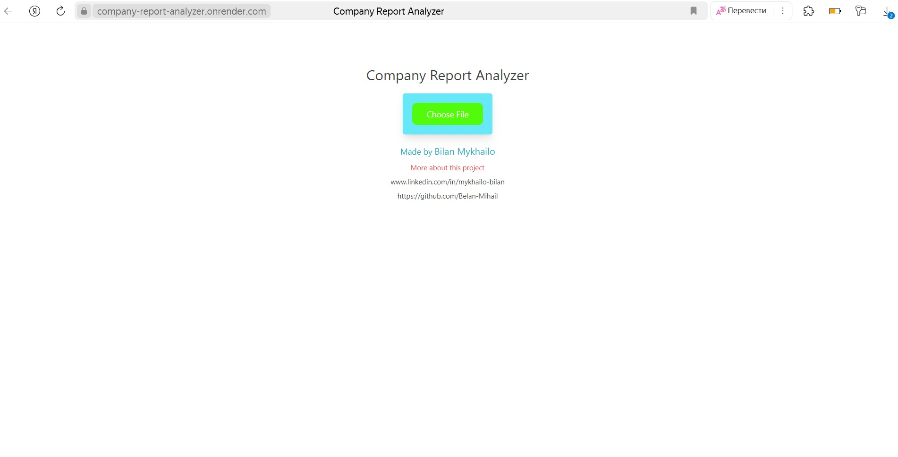

# Company Report Analyzer
(Developer: Bilan Mykhailo)

[Live webpage](https://company-report-analyzer.onrender.com/)

## About Project
Company Report Analyzer is an application that processes a data file and, based on the processing results, generates reports requested by the user.

In this test version, the application processes one test file and can generate up to 8 reports.

But if this application is implemented in your company and modified to meet the needs of your company, it will be able to process ANY and ALL reports of your company and generate a huge number of specified reports.